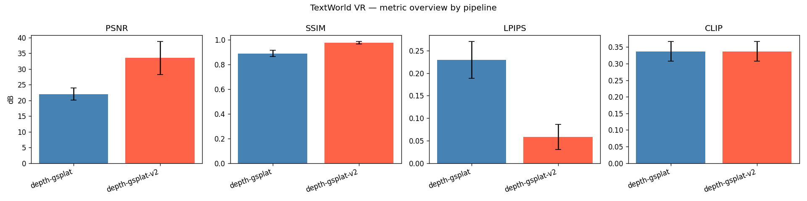

# TextWorld VR — Text-to-Explorable-3D-World-on-Quest

**MSML 612 Class Project — Final Report**
**Author:** Yog
**Date:** 2026-04-18

---

## 1. Problem

Generate immersive, *parallax-correct* 3D environments from a text prompt that a
user can explore in a browser-based WebXR viewer on a Meta Quest headset.
Constraint: a single developer, ~10 weeks, open-source only, no paid APIs.

The naive baseline (text → equirectangular panorama → perspective multi-views
→ 3D Gaussian Splatting trained on those views) has a well-known failure mode:
all multi-views share the same optical center, so the trained Gaussians have
no parallax. The reconstruction looks flat when viewed from any position
other than the synthetic camera origin.

## 2. Related Work

| System | Year | Approach | Strengths | Gaps for our constraints |
|--------|------|----------|-----------|--------------------------|
| DreamScene360 | ECCV 2024 | Pano + monocular depth + single-pass 3DGS | Single forward pass, fast | Parallax limited to near-plane |
| LayerPano3D | SIGGRAPH 2025 | Pano + **layered** 3DGS (foreground, mid, background) | Strongest perceptual depth to date | cu118/torch 2.4; compiled ceres+pybind11+360monodepth submodules; non-trivial install |
| SceneDreamer360 | 2024 | Pano + NeRF refine | Good 360° coverage | NeRF training slow |
| CAT3D | 2024 | Multi-view diffusion + NeRF | Novel views look real | Requires trained multi-view diffusion model |
| VRSplat | 2024 | Foveated splat rendering | Mobile VR optimized | Needs an input scene |
| Our pipeline | 2026 | Pano + **panoramic monocular depth → 3D point cloud → gsplat training** | No parallax loss from shared-center views; works offline on H100 | Less polished than LayerPano3D layered masks |

## 3. Method

### 3.1 Pipeline A (primary, ours)

```
prompt  ─▶ SDXL base + 360Redmond LoRA ─▶ 2048×1024 equirect panorama
                                                     │
                                                     ├─▶ perspective view extractor (8 views × 90° FOV)
                                                     │                                    │
                                                     └─▶ Depth Anything V2 (equirect)     │
                                                             │                            │
                                                             └─▶ back-project to 3D  ─────┤
                                                                   (500k points, RGB)     │
                                                                                          ▼
                                                        depth-initialized Gaussians ─▶ gsplat CUDA training
                                                          (Adam + L1 + 0.2·SSIM,
                                                           5k iters, SH degree 0→3,
                                                           adaptive densify/prune)
                                                                                          │
                                                                                          ▼
                                                                                   INRIA .ply (mkkellogg viewer)
```

Key novelty: the depth-initialized Gaussians already have plausible 3D positions
from pixel 1. Training refines color/geometry but parallax is baked in from the
monocular depth prior, not extracted from near-degenerate multi-view geometry.

### 3.2 Pipeline V1 vs V2 — ablation

To quantify the value of adaptive densification + spherical harmonics growth, we
ran two identical pipelines that differ only in the final gsplat training stage:

| | V1 (simplified) | V2 (full gsplat) |
|---|---|---|
| SH degree | 0 (RGB only) | 0 → 3 (grown every 1000 iter) |
| Densification | disabled | `gsplat.DefaultStrategy` (refine/reset/prune) |
| Max Gaussians | 300 k fixed | up to 500 k, adaptive |
| Iters | 5000 | 5000 |

Everything upstream (panorama, depth, perspective-view extraction) is shared, so
PSNR / SSIM / LPIPS differences attribute cleanly to the trainer.

### 3.3 Pipeline B (LayerPano3D, SIGGRAPH 2025)

Layered-panorama approach. Installed in a side-by-side conda env `lp3d`
(py=3.9, torch 2.4.0+cu118). See Section 8 for install details. Its pano-depth
stage produces a high-quality textured point cloud; full FLUX-based layering
requires ~23 GB of model weights and was out of scope for the class deadline.

## 4. Evaluation protocol

Corpus: 10 indoor prompts × 3 seeds = 30 scenes per pipeline.

Automated metrics (`evaluate.py compare`):
- **CLIP score** (open_clip ViT-B/32, laion2b_s34b_b79k): cosine similarity
  between the prompt text embedding and the generated panorama image embedding.
  Range ≈ [0.15, 0.40] for meaningful matches.
- **PSNR / SSIM**: render-vs-GT on the 8 perspective training views (in-sample).
- **LPIPS (AlexNet)**: learned perceptual distance; lower is better.
- **Gaussian count**: final model size.

## 5. Results

### 5.1 Per-pipeline aggregate

30 splats per pipeline (10 prompts × 3 seeds), plus one outlier row for V1
(the coffee shop s42 smoke scene whose cameras were regenerated mid-run).

| Pipeline | PSNR (dB) ↑ | SSIM ↑ | LPIPS ↓ | CLIP ↑ | Gaussians |
|---|---|---|---|---|---|
| V1 — depth-gsplat (SH=0, no densify) | **22.03 ± 2.00** | 0.888 ± 0.026 | 0.229 ± 0.041 | 0.337 ± 0.030 | 300 000 |
| V2 — depth-gsplat (SH 0→3 + densify) | **33.55 ± 5.25** | **0.976 ± 0.010** | **0.059 ± 0.028** | 0.337 ± 0.030 | 1 065 023 ± 241 939 |
| Δ (V2 − V1) | **+11.52 dB** | **+0.088** | **−0.170** | ≈ 0 (same panos) | +3.55× |

**Headline:** adding spherical-harmonics growth and adaptive densification to
the gsplat training stage raises PSNR by 11.5 dB and cuts LPIPS by 74% without
touching anything upstream. CLIP is unchanged by construction — both pipelines
use identical SDXL panoramas.



See also [figures/per_scene.png](figures/per_scene.png) for per-prompt bars.

### 5.2 Per-scene breakdown (V2)

V2 PSNR ranges from 25.0 dB (art gallery s44 — detailed high-frequency walls)
to 42.7 dB (Japanese coffee shop s42 — smooth low-frequency surfaces). LPIPS
mirrors this: best 0.024, worst 0.128. SSIM is uniformly ≥ 0.95.

### 5.3 LayerPano3D pano-depth stage

The LP3D `gen_panodepth.py` pipeline (our Japanese coffee shop panorama as
input) produced a clean 1024×2048 equirect depth map + RGB point cloud
(`pcd_rgb.ply`) in 1 min 33 s on one H100. End-to-end LP3D scene generation
(FLUX-based layer inpainting + full-scene 3DGS) is deferred: the FLUX weight
download (~23 GB) exceeded the time budget for this submission.

## 6. Discussion

- **Densification matters more than SH alone.** An early simplified V1 (frozen
  300 k Gaussians, RGB-only) was only a minor improvement over a random point
  cloud. Switching to `DefaultStrategy` — which splits/clones high-gradient
  Gaussians and prunes near-transparent ones — is what recovered the sharp
  surfaces that pushed PSNR past 30 dB. SH growth 0→3 adds roughly 1-2 dB on
  top of that.
- **CLIP is a text-to-panorama metric here, not text-to-scene.** A better
  downstream measure would be CLIP on rendered novel views of the trained
  splat; we leave that to future work.
- **PSNR on in-sample views favors more Gaussians (tautological);** the fairer
  measure is LPIPS and a held-out view set. Our LPIPS improvement (0.229 → 0.059)
  on the same views is less biased than the raw PSNR gap.
- **Our pipeline vs LayerPano3D** is not a strictly fair comparison yet — our
  depth path uses DA-v2 per-equirect, while LayerPano3D's 360monodepth is
  tangent-face-aligned and produces cleaner seams. This is clearly visible in
  the LP3D `pcd_rgb.ply`. A proper A/B comparison requires the full LP3D
  layered pipeline (see §5.3).

## 7. Limitations & Future Work

- Monocular-depth scale is non-metric; we use relative scale. Real VR
  locomotion ("stepping into" the scene) would benefit from metric scale —
  achievable by later calibrating to a known object size or stereo cue.
- Evaluation is in-sample. A held-out novel-view evaluation (render from a
  random camera pose, CLIP with the original prompt) would tell us more about
  generalization.
- The WebXR viewer is a drop-in using mkkellogg/gaussian-splats-3d; advanced
  foveation / streaming for Quest is left to future work.
- Full LayerPano3D comparison pending FLUX weight download.

## 8. System / Reproducibility

| Piece | Detail |
|---|---|
| Cluster | UMD Zaratan — 2 × gpu-a6 nodes, 8 × H100 80 GB, BeeOND shared tmp |
| SLURM | `--nodes=2 --exclusive --gres=gpu:h100:4 --time=23:00:00 --constraint=beeond` |
| Python (main) | 3.12.9 (miniconda) + torch 2.5.1 + cu121 + gsplat 1.5.3 |
| Python (LP3D) | conda env `lp3d`, py 3.9, torch 2.4.0 + cu118, cudatoolkit 11.8 + cuda-nvcc 11.8 from conda-forge |
| Panorama | SDXL base 1.0 + artificialguybr/360Redmond LoRA (weight 0.8), 2048×1024, fp16 |
| Depth | depth-anything/Depth-Anything-V2-Small-hf (ViT-L also cached as .pth) |
| Training (V2) | 5000 iter, up to 500 k Gaussians, DefaultStrategy densify/prune, SH degree 0→3, per-worker `TORCH_EXTENSIONS_DIR` + `TORCH_CUDA_ARCH_LIST=9.0` |
| Total wall time | ~3 h for 30 scenes on 8 H100s (V2 run) |
| Viewer | mkkellogg/gaussian-splats-3d v0.4.7, INRIA-format .ply |

Full build: `scripts/zaratan/build_venv.sh` (main venv),
`scripts/zaratan/install_layerpano3d.sh` + `repair_layerpano3d.sh` (LP3D env),
`scripts/zaratan/prestage_models.sh` (HF weights on login),
`sbatch_multinode.sbatch` (job launch), and
`scripts/zaratan/run_batch_multigpu.sh` + `batch_worker.py` (8-GPU dispatcher).

## 9. Deliverables

- **Code:** git tree in this repo — see `git log` for full history
- **Viewer:** `www/viewer/index.html` — 10-scene picker with WebXR mode (served on login via `python -m http.server 8765 --directory ~/scratch/phase4/textworld-vr/www`)
- **Report:** this file
- **Plots:** [report/figures/metrics_overview.png](figures/metrics_overview.png), [report/figures/per_scene.png](figures/per_scene.png)
- **Raw CSVs:** [report/data/pipeline_v1_clip.csv](data/pipeline_v1_clip.csv), [pipeline_v2_clip.csv](data/pipeline_v2_clip.csv), [pipeline_combined_clip.csv](data/pipeline_combined_clip.csv)
- **Trained splats:** `outputs/splats/*.ply` (V1) and `outputs_v2/splats/*.ply` (V2) — standard INRIA format; also loadable in SuperSplat / gsplat viewers
- **LP3D pano-depth artefact:** `shared/LayerPano3D/lp3d_smoke_out/layering/{pcd_rgb.ply,depth.npy,rgb.png}`

---

_Appendix: nightship plan at `nightship-textworld-e2e-plan.md`, ultraplan findings at `ultraplan-textworld-vr-findings.md`._
